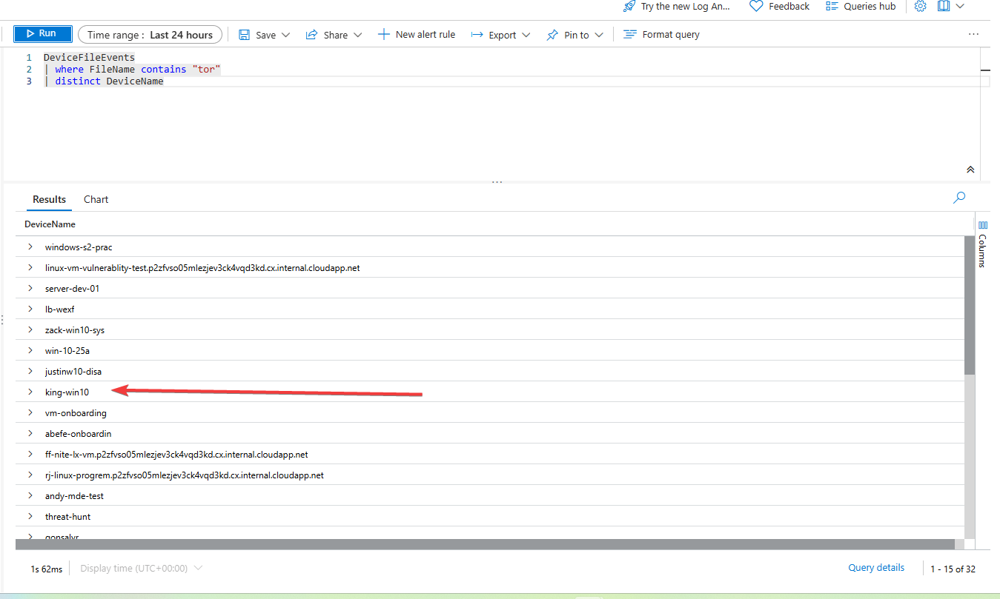
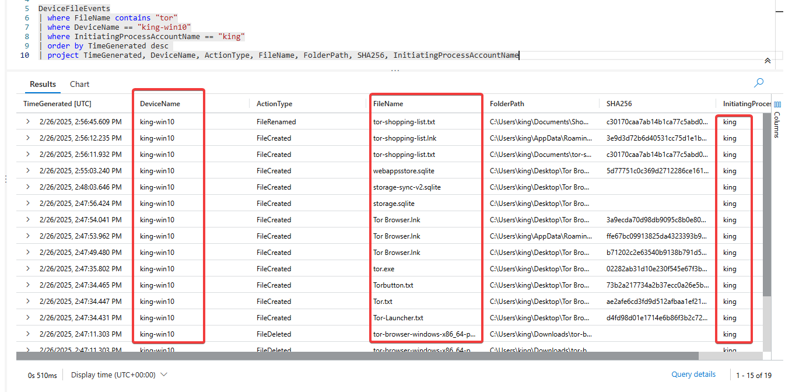
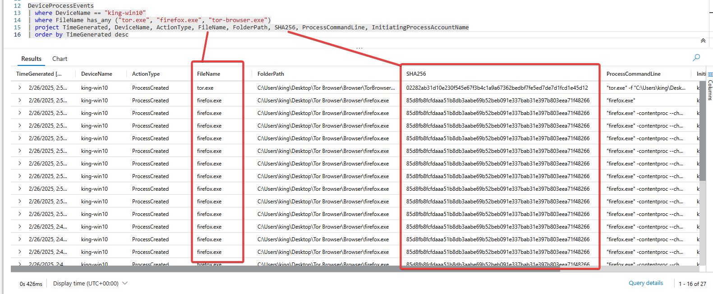
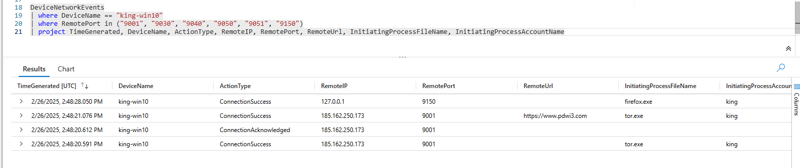

# Threat Hunt Report: Unauthorized TOR Usage
- [Scenario Creation](https://github.com/K-ING-TECH/Threat-Hunt_TOR-Browser/blob/main/Threat-Hunting-Scenario_TOR-Event-Creation.md)

## Platforms and Languages Leveraged
- Windows 10 Virtual Machines (Microsoft Azure)
- EDR Platform: Microsoft Defender for Endpoint
- Kusto Query Language (KQL)
- Tor Browser

## Scenario

Management suspects that some employees may be using TOR browsers to bypass network security controls because recent network logs show unusual encrypted traffic patterns and connections to known TOR entry nodes. Additionally, there have been anonymous reports of employees discussing ways to access restricted sites during work hours. The goal is to detect any TOR usage and analyze related security incidents to mitigate potential risks. If any use of TOR is found, notify management.

### High-Level TOR-Related IoC Discovery Plan

- **Check `DeviceFileEvents`** for any `tor(.exe)` or `firefox(.exe)` file events.
- **Check `DeviceProcessEvents`** for any signs of installation or usage.
- **Check `DeviceNetworkEvents`** for any signs of outgoing connections over known TOR ports.

---

## Steps Taken

### 1. Searched the `DeviceFileEvents` Table

Searched for any file that had the string "tor" in it and discovered that user `king` downloaded a TOR installer, which resulted in multiple TOR-related files being copied to the desktop, along with a file named `tor-shopping-list.txt`.

By running the following command, I obtained a list of all devices with the relevant files:

```kql
DeviceFileEvents
| where FileName contains "tor"
| distinct DeviceName
```




For the sake of this report, we will be focusing on the device **king-win10**.

**Events began at:** `2025-02-26T14:47:00.2583461Z`

**Query used to locate events:**

```kql
DeviceFileEvents
| where FileName contains "tor"
| where DeviceName == "king-win10"
| where InitiatingProcessAccountName == "king"
| order by TimeGenerated desc 
| project TimeGenerated, DeviceName, ActionType, FileName, FolderPath, SHA256, InitiatingProcessAccountName
```




---

### 2. Searched the `DeviceProcessEvents` Table

Checked if the user executed the TOR installation file and launched the application.

**Query used to locate event:**

```kql
DeviceProcessEvents
| where DeviceName == "king-win10"
| where FileName has_any ("tor.exe", "firefox.exe", "tor-browser.exe")
| project TimeGenerated, DeviceName, ActionType, FileName, FolderPath, SHA256, ProcessCommandLine, InitiatingProcessAccountName
| order by TimeGenerated desc
```




Returned the following, which is a process generated by the application upon launching and browsing:

```
"firefox.exe" -contentproc --channel=4392 -childID 13 -isForBrowser -prefsHandle 5096 -prefMapHandle 5088 -prefsLen 24863 -prefMapSize 252221 -jsInitHandle 1004 -jsInitLen 234780 -parentBuildID 20250206184358 -win32kLockedDown -appDir "C:\Users\king\Desktop\Tor Browser\Browser\browser" - {80699953-0b4b-4643-845e-7be14c5df933} 6220  tab
```

Other instances of **Firefox (TOR)** and **TOR browser** spawned.

---

### 3. Searched the `DeviceNetworkEvents` Table for TOR Network Connections

Checked if the TOR browser was used to establish connections over known TOR ports.

The device **king-win10** made multiple successful outbound connections to **185.162.250.173:9001**, which appears to be a **TOR network node**.
- **Initiating Process:** `tor.exe`
- **Connection Status:** Acknowledged (the remote server responded successfully).
- **Related Remote URL:** `https://www.pdwi3.com` (involved in the communication).

**Query used to locate events:**

```kql
DeviceNetworkEvents
| where DeviceName == "king-win10"
| where RemotePort in ("9001", "9030", "9040", "9050", "9051", "9150")
| project TimeGenerated, DeviceName, ActionType, RemoteIP, RemotePort, RemoteUrl, InitiatingProcessFileName, InitiatingProcessAccountName
```




---

## Chronological Event Timeline

### 1. File Download - TOR Installer
- **Timestamp:** `2025-02-26T14:47:00.2583461Z`
- **Event:** User `king` downloaded a TOR installer.
- **File Path:** `C:\Users\king\Desktop\Tor Browser\tor.exe`

### 2. Process Execution - TOR Browser Launch
- **Timestamp:** `2025-02-26T14:50:12.6357935Z`
- **Event:** User `king` opened the TOR browser, spawning several `firefox.exe` and `tor.exe` instances.
- **File Path:** `C:\Users\king\Desktop\Tor Browser\Browser\TorBrowser\Tor\tor.exe`

### 3. Network Connection - TOR Network
- **Timestamp:** `2025-02-26T14:52:01.1246358Z`
- **Event:** A connection to `185.162.250.173:9001` was established by `tor.exe`, confirming TOR browser activity.
- **Action:** Connection success.

### 4. File Creation - TOR Shopping List
- **Timestamp:** `2025-02-26T14:55:19.7259964Z`
- **Event:** The user `king` created a file named `tor-shopping-list.txt` on the desktop.
- **File Path:** `C:\Users\king\Desktop\tor-shopping-list.txt`

---
## Response Taken

TOR usage was confirmed on endpoint `king-win10`. The device was isolated, and the user's direct manager was notified.

---
## MITRE ATT&CK TTPs
- **Initial Access (TA0001) -** Application Layer Protocol: Web Protocols (HTTP/S) (T1071.001)
- **Execution (TA0002) -** Command and Scripting Interpreter: PowerShell (T1059.001)
- **Persistence (TA0003) -** Create or Modify System Process: Windows Service (Tor) (T1543.003)
- **Privilege Escalation (TA0004) -** Valid Accounts (T1078)
- **Defense Evasion (TA0005) -** Indicator Removal: File and Directory Permissions Modification (T1070.003)
- **Defense Evasion (TA0005) -** Obfuscated Files or Information (T1027)
- **Credential Access (TA0006) -** Application Layer Protocol: Web Protocols (T1071.001)
- **Discovery (TA0007) -** Account Discovery: Local Account (T1087.001)
- **Exfiltration (TA0010) -** Exfiltration Over Command and Control Channel (T1041)


---
## Summary

User `king` on device `king-win10` installed, launched, and used the TOR browser, establishing connections to a known TOR entry node and creating a document that could be related to TOR activities.

---

